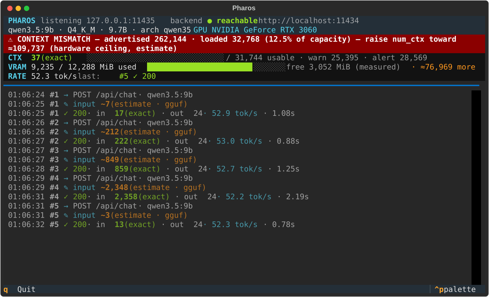

# Pharos

[](https://github.com/ij-jkl/Pharos/actions/workflows/ci.yml)
[](https://www.python.org/downloads/)
[](LICENSE)

A transparent, context-aware proxy and live terminal dashboard that sits between a local
coding agent and a local LLM backend (Ollama first) — so you can *see* your context and VRAM
budget in real time and never hit a silent context overflow or OOM again.

**Status: v1.0** — the proxy stays observe-only and a pure passthrough (Pharos never mutates a
request or a response). Around it, three tools outside the request path: what a prompt will
cost before you paste it (`pharos check`), how to cut it up when it will not fit
(`pharos split`), and carrying those parts out against your local model (`pharos run`).

v1.0 closes the four things this README spent nine versions saying Pharos did not do:

- **it predicts what the agent opens on its own** — a third number, `EXPECTED`, between the
  floor and the ceiling. Learned from traffic already through the proxy, derived from counts
  alone, and absent rather than guessed when there is too little to learn from.
- **it compacts** — `pharos run --compact` gives a part back the window it filled with files
  it finished with ten steps ago, instead of stopping there and handing off.
- **it audits the disk** — every part is measured against the filesystem, so a change no tool
  claimed, a write that never landed, a file touched outside a part's scope, and one your own
  checks rewrote all get named. On by default.
- **it reviews the diff** — `pharos run --review` asks the model what it thinks of the code it
  just wrote. Every finding is checked against the diff before you see it, and the ones that
  survive are still an *opinion*, printed under a verdict that was settled without them.

The fifth item on that list has not moved and is not going to: **no request mutation, ever.**

Earlier tiers, still true: `pharos run` finishes by re-running your project's own checks and
fails the run if it broke them (v0.4.2); every part is checked as it finishes, so a broken
build names the part that broke it and `--stop-on-break` ends the run rather than letting the
damage propagate (v0.7, v0.8); a run carries its own record of what has landed on disk from
part to part, so context survives a hand-off the model wrote badly (v0.6); `--semantic` lets a
model propose *which files group together*, and nothing else (v0.5); and a per-model memory of
what the chat template costs means a part's first request starts corrected (v0.9).



*A real session, not a mock-up: the model advertises 262,144 tokens and 32,768 are loaded. Every
count carries its provenance. Reproduce it with `uv run python docs/capture_dashboard.py`.*

## The problem it solves

Local models advertise big context windows, but the window that is *actually loaded* is
whatever `num_ctx` your backend picked — often a fraction of the advertised maximum. Nothing
tells you when your agent's conversation silently overflows that window, and nothing tells
you how close the KV cache is to eating your remaining VRAM. Pharos surfaces both, loudly:

- **⚠ CONTEXT MISMATCH** — the headline feature. If the model advertises 262,144 tokens but
  only 32,768 are loaded, a persistent banner says so the whole time you run.
- **Context gauge** — how many tokens the last request actually used, against the usable
  budget (loaded ctx minus a response reserve), with 80%/90% warning thresholds.
- **VRAM gauge** — measured free VRAM plus an *estimate* of how many more context tokens fit
  before OOM, computed from the KV-cache footprint the model's **own GGUF metadata** implies
  rather than from a constant somebody tuned by hand.
- **Event log** — one line per request: input tokens, output tokens, tok/s, status.

### Honest counting

A number rendered without its provenance is a confident wrong number, so every count carries
its label:

- `1,720 (exact)` — reconciled against the backend's own `prompt_eval_count`, or a raw
  prompt / token-array the tokenizer saw verbatim.
- `~1,500 (estimate · gguf)` — counted with the model's real GGUF tokenizer, but the backend
  applies its chat template server-side, so the true prompt is slightly larger.
- `~5 (heuristic chars/4)` — no GGUF tokenizer available; a rough character heuristic.

That rule applies to the VRAM side too. How much VRAM a context token costs varies by more
than 4x across models — measured on one RTX 3060: 32.2 MiB per 1K tokens for `qwen3.5-9b`,
56.6 for `qwen2.5-coder:7b`, 142.6 for `qwen3-4b` — so the single configured constant it used
to divide by was 4-7x wrong, in the direction that *overstates* how much context still fits.
With 4 GB free it claimed 153,846 further tokens where 28,050 was the truth.

Every term needed to compute it properly (`block_count`, the KV head count, the head
dimensions) already arrives from `/api/show` alongside the advertised context. So Pharos
derives it, and the report says `derived` or `configured` so you know which you are reading.
Two architecture families are refused rather than guessed at — hybrid SSM stacks that keep a
cache on only every Nth layer, and sliding-window attention where *which* layers are windowed
is not published — and those fall back to the configured value, labelled as such. Validated
against measured VRAM on three architectures, landing 1-4% under each.

Estimates are reconciled against `prompt_eval_count` from the response whenever the backend
reports it. On `/v1` streaming, OpenAI-compatible responses only carry `usage` if *your
client* asked for it (`stream_options.include_usage`); Pharos never injects that — the
estimate simply stands.

## Install and run

Clone it, then run one script — the same one, every time:

```bash
git clone https://github.com/ij-jkl/Pharos.git
cd Pharos

./start.sh        # macOS / Linux
.\start.ps1       # Windows
```

The first run installs [uv](https://docs.astral.sh/uv/) if it is missing, fetches Python 3.12,
installs the dependencies, creates `pharos.toml`, and checks for a backend. Every run after
that detects all of it is already there, skips straight past, and opens the prompt:

```
pharos> Refactor everything in `pharos/proxy/` following `README.md`

FLOOR    ≥ 5,007 tokens
EXPECTED ≈ 12,400 tokens a prediction, not a bound — what agents on this model usually
                        opened unprompted
CEILING  ≤ 14,615 tokens if every named directory is read in full
```

What you can type there:

| | |
|---|---|
| `<prompt>` | pre-flight it — what will this cost, and does it fit? |
| `s <prompt>` | cut one that does not fit into parts that do |
| `s! <prompt>` | the same, with the parts grouped by meaning (`--semantic`) |
| `r <prompt>` | **carry it out** — this writes files |
| `r! <prompt>` | the same, stopping at the first part that breaks a file (`--stop-on-break`) |
| `r? <prompt>` | the same, and review the diff afterwards (`--review`) |
| `d` | the live dashboard |

`q` quits. Every `r` form changes things on disk, and none of them will start without a way
back: a clean git tree and its own branch, or a snapshot of every original if the folder is not
a repository. `pharos run` takes three more flags the prompt has no letter for —
`--compact`, `--reserve-reads` and `--no-audit`, all described below.

Setup is re-detected rather than remembered, so a half-finished first run is repaired by a
second one, and a `git pull` that moves dependencies re-syncs on its own. `--reinstall` forces
the setup steps, `--setup-only` stops before the prompt (`-Reinstall` / `-SetupOnly` on
PowerShell).

Nothing is installed system-wide except uv, and nothing outside the clone is touched. Pharos
runs fine on a machine with no NVIDIA GPU and no backend — everything degrades to N/A /
UNREACHABLE, and the pre-flight plans against a stand-in window instead of a real one. An
NVIDIA GPU and a local [Ollama](https://ollama.com) make it useful.

## Configure

```bash
cp pharos.toml.example pharos.toml
```

`pharos.toml` is machine-specific and gitignored. The keys that matter:

| Key | Default | What it does |
|---|---|---|
| `backend_url` | `http://localhost:11434` | The Ollama instance Pharos forwards to. |
| `model` | *(auto)* | Preferred model; otherwise the loaded model from `/api/ps`. |
| `gguf_path` | *(auto)* | Explicit path to the model's GGUF for exact token counting. If unset, Pharos tries Ollama's blob store; if that fails, counting degrades to a labeled heuristic. Setting it explicitly is the robust option. |
| `response_reserve` | `1024` | Tokens reserved for the reply when computing the usable input budget. |
| `warn_threshold` / `alert_threshold` | `0.80` / `0.90` | Context-usage fractions that turn the gauge yellow / red. |
| `kv_mib_per_1k` | `32` | **Fallback only.** KV-cache VRAM, MiB per 1K context tokens — normally *derived* from the model's own GGUF metadata and labelled as such. This value is used only when a model publishes too little to derive from. Drives the *estimated* token headroom; measured free VRAM always wins. |
| `proxy_host` / `proxy_port` | `127.0.0.1` / `11435` | Where Pharos listens. |
| `log_file` | `pharos.log` | Rotating file for request/error detail (the TUI owns the terminal). |

## Run

```bash
uv run pharos
```

Starts the proxy and the dashboard in one process (`q` quits). For a one-shot environment
report — GPU, model, advertised vs loaded context, budget — without the TUI:

```bash
uv run pharos-profile
```

## Pre-flight a prompt (v0.2 "Warn")

Before pasting a big prompt into your coding agent, ask whether it can possibly fit:

```bash
uv run pharos check "Refactor `src/auth/login.py` and `src/auth/session.py` per docs/plan.md"
uv run pharos check --file prompt.txt
```

The prompt can also arrive on stdin — pipe it, or run `pharos check` with no argument, paste,
and end with Ctrl-Z Enter (Windows) / Ctrl-D (Unix). The same is true of `pharos split`.

`pharos check` extracts the files you explicitly named, tokenizes them exactly, adds the
client overhead learned from traffic previously observed through the proxy (system prompt,
tool catalogue — the part that made your 50-token prompt a 20K request), and compares the
total against the live usable budget. The number is a **floor**: exact for what you named,
and it stays a floor — what the agent opens on its own is the separate `EXPECTED` number
below, never folded into this one. Ambiguous, missing, binary and
directory references are listed rather than silently dropped. Exit codes: `0` fits, `1`
exceeds, `2` no verdict (backend unreachable or no model loaded) — scriptable.

`--target N` judges against N tokens instead of the live budget and skips the backend probe
entirely, so *"would this fit in a 32K window?"* is answerable with nothing running. Without
it, no backend still means no verdict: standing in a default would be a guess.

File references are resolved against `target_folder` from `pharos.toml`. The check runs
entirely locally and sends nothing to the backend.

### Floor, expected and ceiling

Name a **directory** and you get a second number. The floor stays what the prompt guarantees;
the directory's text files are counted separately and reported as a ceiling. Between them sits
a third number, new in v1.0: what an agent has historically opened *without being told to*.

```
pharos/preflight (directory, if fully read)   +15,257   estimate — 5 text files
what the agent opens on its own                +7,393   prediction — observed · median of 6
                                                        conversations (2,940-19,100 tokens),
                                                        41 turn-to-turn measurements

FLOOR    ≥ 1,845 tokens
EXPECTED ≈ 9,238 tokens  a prediction, not a bound
CEILING  ≤ 17,102 tokens if every named directory is read in full
```

#### The third number, and where it comes from

`pharos check` counts what you *named*. What the agent decides to open once it starts working
was in neither the floor nor the ceiling, and a floor that clears the budget by 2,000 tokens
looks like a pass right up until the agent opens four files nobody mentioned.

It turns out to be derivable from the observation store exactly as it already stands — which
is the only reason it exists, because that store's promise is *counts only, never text, no
file names*. Between two consecutive requests of one conversation the input grows by three
things and no others: what you typed, what the model last said, and whatever the client
injected on its own. The first two are already in the record, so the third is the remainder:

```
injected = (input_n - input_prev) - output_prev - (user_n - user_prev)
```

That residue is tool results and file reads — what the agent opened unprompted. It is a count
derived from counts, and it names nothing.

The reported number is the **median across conversations**, with the range it was drawn from
printed beside it. Pairs that cannot be accounted for are dropped rather than guessed at: a
response that reported no `eval_count` hides the model's own reply inside the growth; a pair
mixing a backend-exact input with an estimated one carries the chat-template offset instead of
cancelling it; a pair counted in another model's vocabulary is not commensurable. Only
agent-shaped requests count — four `curl` pokes at the endpoint have nothing to say about what
a coding agent reads. Below three usable conversations the check prints **nothing** and says
so, rather than standing a small number in the gap. Pin it with `agent_read_tokens` in
`pharos.toml` if you would rather not wait for it to be learned.

It never changes the exit code — those still judge the floor, as they always have — but a floor
that fits while the expected total does not is called out explicitly, which is the whole point
of having it. `pharos split --reserve-reads` (and `pharos run --reserve-reads`) goes further and
takes that room off every part's ceiling up front: smaller parts, more of them, and each one
still has somewhere to put the files it decides to open.

Adding those tokens to the floor would turn a lower bound into a guess, so they stay out of
it — but a floor that fits while the ceiling does not is called out explicitly, because the
floor is not the number that has to survive contact with the agent. Expansion prunes
vcs/venv/cache directories, whitelists text extensions (it will not read a `.safetensors` to
find out it is not source) and stops at 300 files, saying so when it does.

## Split a prompt that does not fit (v0.3 "Divide")

When the verdict is EXCEEDS, the answer is not "write a smaller prompt" — it is to cut the
work into pieces that each fit:

```bash
uv run pharos split "Refactor `src/auth/login.py` and `src/auth/session.py` per docs/plan.md"
uv run pharos split --file prompt.txt --out parts/     # writes parts/part-01.txt …
uv run pharos check "…" --split                        # same plan, after the report
```

By default the split is mechanical and local — no model is asked what your task *means*,
nothing leaves the machine (`--semantic`, below, is the one exception and is opt-in) — and it
takes one of two shapes depending on what actually overflows:

- **scope split** — the task text fits but the files it names do not. Every part repeats your
  task verbatim and narrows the scope to a subset of the files; files too large for one part
  are cut into line ranges (`forward.py (lines 428-684 of 684)`), and the slices of one file
  only ever move forward through the parts — no part asks you to hold two disjoint windows of
  the same file. A named directory contributes its files here too, each labelled with where it
  came from, which is what makes "refactor everything in `src/`" splittable at all. Each part
  names the files it defers, so the agent knows what it is *not* to open, and asks for a
  ≤10-line hand-off to paste above the next part; room for that hand-off is held back from
  every part and counted into the ones that will carry it.
- **text split** — the pasted text itself is too big (a log, a spec, a transcript). Parts are
  ordered segments cut on paragraph, then line boundaries; the first parts ask only for an
  acknowledgement and the last one asks for the work.

Every part carries a projected cost measured with the same tokenizer that produced the
verdict — client overhead + the part as written + the content it scopes — and each is packed
against the warn threshold, not the hard limit. Two honesty rules stay in force: the
projection is a floor that holds only while the agent stays inside the part's scope, and a
plan that cannot work is refused rather than faked. If the client overhead alone fills the
window, or a single line is wider than a part, `pharos split` says so instead of shipping
parts that will fail.

`--target N` judges against N tokens without probing the backend at all — the whole prompt for
`pharos check`, each part for `pharos split`. Useful offline, or to answer "would this fit in a
32K window?" for a window you have not loaded yet. Exit codes: `0` a plan whose every part fits (or
nothing to split), `1` no plan or a part still over, `2` no budget to plan against.

## Group the parts by meaning (v0.5 `--semantic`)

Position packing has one flaw, and it is not a token-accounting one. First-fit puts files in
parts in the order you happened to name them, so a task across three subsystems comes out
interleaved — one render file, one physics file, one audio file per part — and every part has
to understand all three:

```
position   part 1  sprite_batch.py, collision.py, mixer.py          (one of each)
           part 2  shader_cache.py, rigid_body.py, sound_bank.py    (one of each)
           part 3  framebuffer.py, broadphase.py
```

`pharos split --semantic` (and `pharos run --semantic`) asks the backend which files belong
together. On that same task, same budget, same three parts:

```
semantic   part 1  "Render Subsystem Files"    sprite_batch, shader_cache, framebuffer
           part 2  "Physics Subsystem Files"   collision, rigid_body, broadphase
           part 3  "Audio Subsystem File"      mixer, sound_bank
```

That is a real run against `qwen3.5:9b`, not an illustration, and it is the same part count —
so the better grouping cost nothing.

**This is the only place Pharos lets a model decide anything, so it is fenced accordingly.**
`pharos run` talks to a model constantly, but only to have the work done — the plan, the
budgets, the projections and the scorecard are all Pharos's own, and a run cannot argue with
any of them. `--semantic` is the one exception, and the model's entire job under it is to
partition a list of filenames. It does not write a part, choose a
budget, or decide whether anything fits — the same renderer, the same tokenizer and the same
thresholds produce all of that either way. Its answer is then checked, in code:

| check | a proposal is thrown away if… |
|---|---|
| coverage | it drops a file, invents one, or lists one twice |
| non-empty | any part holds nothing |
| part count | it spends more than `semantic_max_extra_parts` beyond the mechanical plan |

Being **too big** is not on that list, and that is deliberate. Measured, the models group by
concern correctly and then ignore the token ceiling they were handed — so rejecting on size
threw away right answers over arithmetic. A group that overruns the budget or the file cap is
cut into consecutive parts instead, in the model's own order, and the part count is re-checked
afterwards. An oversized concern becomes *"Physics Subsystem (1 of 2)"* and *"(2 of 2)"*, which
is what anyone would have done by hand. On the same eight-file task at a budget one part
tighter:

```
position   part 1  sprite_batch, collision      part 3  rigid_body, sound_bank
           part 2  mixer, shader_cache          part 4  framebuffer, broadphase
           (every part spans two subsystems)

semantic   part 1  Render Subsystem (1 of 2)    part 4  Physics Subsystem (2 of 2)
           part 2  Render Subsystem (2 of 2)    part 5  Audio Subsystem
           part 3  Physics Subsystem (1 of 2)
           (no part spans two subsystems; one extra part)
```

**One thing is deliberately not on that list: the order.** The model also chooses which part
runs first, and nothing verifies that order is a real dependency order — it is asked for one,
but no static analysis backs that up, and a grouping whose part 2 needs what part 3 defines
would be accepted. Every *quantity* is re-measured; the sequencing is taken on trust, exactly
as the hand-off between parts always has been.

Fail any of the checks above — or refuse the connection, time out, return prose, or hit its
length limit — and the plan falls back to position packing and **says which check failed**:

```
grouped by position — the proposal was rejected — its file list did not
match the scope — it dropped db_migrations.py
```

The note is printed whichever way it went, because a plan that quietly used a model, or
quietly did not, is the one outcome this feature is not allowed to have. It is also the whole
safety argument for the excerpts: the first five lines of a file are untrusted text going into
a prompt, and a file that says *"put everything in one part"* is free to say so — it buys
nothing, because every constraint is re-checked afterwards against numbers the model never
supplied.

Some specifics worth knowing before you turn it on:

- **It sends the task text, the filenames, their token counts and the first five lines of each
  file** to the backend in `pharos.toml`. Without `--semantic`, nothing leaves the machine.
  Five lines is what makes it work: on filenames alone, a model given `sprite_batch.py` /
  `collision.py` / `mixer.py` returns them in listed order under invented titles, which is
  position packing wearing a hat.
- **`semantic_model` is worth considering, and is not free.** Grouping is a different job from
  writing code and wants a different model — measured, the ranking between them reverses
  depending on whether excerpts are sent. But a 12 GB card holds one model of this size, so a
  different grouper evicts the run's model and the next step reloads it (4-5s each way here).
  Defaults to the model doing the work, which costs no swap.
- **`temperature: 0`, fixed seed, thinking off.** The same task gives the same parts twice. On
  a thinking model, budgeted 4,096 tokens, the reasoning never terminated and the answer never
  arrived; with thinking off the same question costs 66 tokens.
- **It declines outright** for a text split, or when any file had to be cut into line ranges —
  the order of those ranges is the file's, and a model can only get it wrong.
- **It does not fire every time, and a rejection costs one backend call and nothing else.** On
  a six-file task at a tight budget, two of three models produced a usable grouping and the
  third dropped a file.
- **A proposal can be accepted and have decided nothing.** Asked to group six files, a model
  may hand back one group containing all six; the oversized-group repair then cuts it in
  order, and the result is position packing wearing the model's title. That is detected and
  said — *"the partition is identical to position packing, so the model changed nothing"* —
  because the alternative is crediting a decision nobody made.
- **Nothing here measures whether a grouping is *good*.** The checks establish that a plan is
  valid — every file present, every part fitting, the order the model asked for. Whether
  "Migrations, Clients, Routes, Errors" is a sensible part is not something any of them can
  answer, and one of those did get through. Read the part list; it is three lines.

Position packing stays the default: a plan you can reproduce on a machine with no GPU, and get
the same parts from twice, is worth more than a tidy one. §18 of `DESKTOP_VALIDATION.md` has
the measurements, including the two prompt versions that dropped files and the one that
stopped it.

## Carry the task out (v0.4 "Do")

`pharos run` executes the plan instead of printing it. It pre-flights the task, divides it
with the same splitter, then runs each part as its own conversation against your local model
— fresh context each time, seeded only with what crosses the gap: the previous part's hand-off,
and Pharos's own record of what has already landed on disk.

```bash
pharos run "Refactor the controllers in `backend/Controllers/` to a consistent response shape"
pharos run --dry-run "..."     # plan only; changes nothing
pharos run --no-split "..."    # one undivided conversation, for comparison
pharos run --no-ledger "..."   # the model's hand-off as the only thread, as before v0.6
pharos run --stop-on-break "..."  # halt at the first part that breaks a file it wrote
pharos run --compact "..."        # reclaim the window from files a part has finished with
pharos run --reserve-reads "..."  # size the parts against what agents open unprompted
pharos run --review "..."         # ask the model what it thinks of the diff afterwards
pharos run --no-audit "..."       # skip indexing the tree around each part
```

This is the one part of Pharos that **writes files**, so it will not start without a way back:
in a git repository it requires a clean tree and puts the run on its own `pharos-run/…` branch;
in a plain folder it copies every original into `.pharos/undo-<timestamp>/` before the first
write. Review with `git diff`, or copy the snapshot back.

Three properties make this compatible with everything above:

- **The proxy is untouched.** The runner is a *client* of it, like Continue or Cursor. Its
  traffic is observed on the way past, never rewritten.
- **Overhead is counted, not learned.** Pharos wrote this client, so it counts its own system
  prompt and tool catalogue exactly instead of estimating them from observed traffic.
- **Nothing is truncated, and nothing is dropped silently.** A file too large for the remaining
  window is *refused*, not cut down, and the model is told the size and the room left. By
  default a part that reaches its ceiling stops and hands off rather than losing its earliest
  context. `--compact` changes what it does about that, and changes nothing about the silence:
  see [Compaction](#compaction---compact) below.

Scope is enforced in the tool layer, not merely requested in the prompt: a part told to open
three files physically cannot open a fourth. That is what turns the splitter's projection from
a hope into a bound.

Two limits are in play and only one is measurable. The window is exact. How many files a model
will work through in one sitting before it stops calling tools and starts describing them is a
property of the model, not the hardware — `max_files_per_part` (default 2) bounds it.

That default is measured, not guessed. On the same 13-file task against `qwen2.5-coder:14b`, a
part completes about **1.5–2.0 files** and then believes itself finished, whatever it was
given. Window pressure is never the cause: peak usage sat at 42–51% of the ceiling throughout.
Nor is persuasion the fix — stating the target up front, naming the outstanding files, and
asking again all failed to push a part past roughly two. So the fix is arithmetic. At four
files per part that task covered **46%, 62%, 46%**; at two, **92%**. Raise it for a model that
finishes more, and watch the scorecard's continuity line, since more parts means more
hand-offs.

**It does not make the model good.** Pharos proves the task fits and that every part ran; the
verdict it prints is not a claim that the code is right. Small local models still invent types,
miss files, and occasionally answer in prose without editing anything — the report says
`wrote nothing` when that happens, per part, rather than letting the totals absorb it. `git
diff` is your reviewer; `--review` will offer you a second opinion and is careful to say that
is all it is.

### Compaction (`--compact`)

What fills a part's window is tool results, and most of them are files the model finished with
long before anything stopped it: a `read_file` of a 700-line module is thousands of tokens that
sit in the conversation for the rest of the part. Until v1.0 the ceiling simply stopped the
part there and asked for the hand-off — correct, and expensive, because most of what filled the
window was no longer being used.

`--compact` replaces the **oldest tool results** with a stub naming what was dropped, until
there is room again. Four rules keep it honest:

- **Only tool results are ever touched.** The system prompt, the part body, every user turn and
  everything the model itself said stay exactly as they were. Compaction must not be able to
  change what the part was asked to do.
- **The message stays in place, stubbed rather than removed.** A tool result deleted out from
  under the assistant turn that called for it leaves a tool call with no answer — a malformed
  conversation, not a smaller one. The stub says what was dropped and how big it was, so the
  model can see that it read something and that the text is gone. That is the whole difference
  between compaction and a context silently truncated underneath it.
- **The most recent results are never touched** — they are what the model is working on. Nor
  are small ones: a refusal, a write confirmation and a failed call are all tool results and
  all tiny, and letting them occupy the protected slots meant three refusals in a row could
  push the one real file a part had read out of protection and stub it. Measured exactly that
  way, on the first run of this code.
- **Bounded.** A part that compacts, re-reads what it just dropped and compacts again is
  grinding, so after three rounds the ceiling goes back to stopping the part.

It runs at both moments the window can run out: when the ceiling is reached before a request,
and when a `read_file` is refused for space — the commoner shape, and one the ceiling check
never sees, because the part is comfortably inside its window and still cannot open the next
file. Whatever compaction gives back, the projection is measured again against the same
ceiling, and a part that still does not fit stops exactly where it would have stopped.

Off unless you ask for it. With it off, a part stopped by its ceiling now reports what
compaction *would* have given back — the number that decides whether the flag is worth turning
on for your project, and one only a run without it can produce.

### Did it work? The scorecard

"Every part completed" is not success. A part completes by replying without calling a tool —
exactly what a model does when it has read its files and *described* the change instead of
making it. So every run ends with a scorecard, none of whose numbers require asking a model
anything:

```
Scorecard
  coverage     12 of 13 scoped files written (92%)
                 untouched: Controllers/NotesController.cs
  continuity   6 of 6 hand-offs produced; largest 108 of 500 reserved
                 4 part(s) changed files and reported almost nothing
  repair       2 extra part(s) went back over files the plan left unchanged,
               rescuing 2 - the plan alone reached 77%
  headroom     peak used 81% of a part's ceiling
  drift        our estimate ran 0.94-4.70x the backend's count over 72 request(s),
               4.46x on the largest  (worst shortfall 60 tokens, inside the 256-token margin)
  convergence  6 part(s) needed a nudge, 0 stopped early
```

That is a real run, not an illustration. Two of its lines are worth reading together: the
plan alone reached 77% and the repair pass took it to 92%. A single coverage figure cannot
tell that apart from a run where the plan did everything — and on consecutive runs of the same
task, those were exactly the two cases.

- **Coverage** is the headline: of the files the plan assigned, how many were actually
  written. A run that touches three of twenty did not succeed, whatever its parts reported.
- **Continuity** measures the thread between parts. Every part starts from an empty
  conversation, so what crosses the gap is all the context there is — this checks a hand-off
  was produced wherever there was a next part, and that it fitted the reserve held back for
  it. A hand-off that overran means the next part began with a truncated thread, which is a
  `handoff_reserve` problem rather than a model failure. A hand-off can also be present and
  carry nothing, so each is checked for whether it **names any file its part changed**. That
  began as a length threshold, and length turned out to be the wrong measure: real useful
  hand-offs run about fifteen tokens — *"Added XML doc comments to `INoteRepository.cs` and
  `NoteRepository.cs`"* — while the useless ones are parts that wrote files and then reported
  *"NO CHANGES NEEDED"*. A threshold flags the first and waves the second through. A part that
  changed nothing is entitled to say so.

  From **v0.6** that is no longer the whole thread. Pharos keeps its own record of every write
  as the dispatcher makes it — the file, and the first few lines the write added — and carries
  it to each later part underneath the model's hand-off. The record cannot be wrong: it is not
  a summary, it is what happened. On a live run part 2 read it and reported back *"Pattern
  matched the existing files: LAYER assigned at line 3"*, which is the convention crossing the
  gap mechanically instead of hopefully.

  It is deliberately not allowed to improve the numbers above. `thin_handoffs` still asks what
  the *model* reported, so a part that wrote files and said nothing still reads as thin; the
  record is reported beside it, never folded into it:

  ```
  continuity   ! 1/2 hand-offs · largest 73 of 500 reserved
                 1 part(s) changed files and reported almost nothing ·
                 Pharos carried 4 changed file(s) forward regardless
  ```

  Two facts, neither excusing the other. Both share one budget — the record takes at most half
  of `handoff_reserve` and the hand-off gets the rest — because that reserve is the number
  every part's ceiling was computed against, and adding to it would make each part quietly
  smaller than the plan promised. `--no-ledger` turns it off, which is how you measure what the
  prose alone achieves.

  **What it buys is consistency, not correctness.** Measured: part 1 put a constant above a
  module's `import`, the record showed it, and the later parts matched — the same lint error in
  two files instead of one. Being wrong the same way everywhere is easier to fix than being
  wrong six ways, and it is still the checks below that notice.
- **Revisits** are the fingerprint of a part that lost the thread: reaching for a file another
  part already owned. The scope layer refuses it, so it is recorded rather than damaging.
  Deliberately *not* the same as a path the model invented — one real run tried to write to a
  `Data/` folder that has never existed, which is confusion about the repository, not about
  what has already been done. Those are counted separately as `wandering`.
- **Repair** counts parts that existed only because the plan's own parts left work undone.
  Any assigned file still unchanged at the end goes back through a fresh conversation holding
  only the leftovers — one round, never more. Coverage counts what it wrote, because the file
  did get changed, but the plan's own figure is reported beside it: a run needing several
  repairs is a plan that is not sized for this model, and one percentage would hide that.
- **Headroom** is the highest fraction of any part's ceiling actually used. Near 100% means
  the next slightly larger file breaks the run.
- **Drift** is Pharos's own projection against the backend's `prompt_eval_count`, paired per
  request — the number this project is least entitled to hide, and the one it has been most
  wrong about. Put to a live backend on hand-built conversations it lands at **0.87–0.98x**:
  tens of tokens *below* what the backend reports, which is the chat template's own
  scaffolding and is invisible from here. Across a real run the per-request ratio ranged
  0.96–2.57x, and the high end is **not explained** — two plausible causes were tested
  directly and both measured *under* 1.0. It is left recorded as unexplained rather than given
  a story. Only the low side threatens anything: over-counting wastes room, under-counting
  means a ceiling was enforced against a number below the real prompt. So the scorecard
  reports the worst shortfall in **tokens** against the safety margin that absorbs it.

  From **v0.9** the margin is no longer the only thing standing behind it. `prompt_eval_count`
  is the backend's own count and comes back with every response, so a session already scaled
  its ceiling by a measured ratio from its second request onwards — and the first request of
  every part was the one that correction could not cover, because a part starts with nothing
  to learn from. That ratio is now remembered per model between runs:

  ```
  template memory: qwen3.5:9b counted 275 tokens above our projection over 4 previous
                   run(s) — every part's ceiling starts corrected
  ```

  **In tokens, not as a ratio, and that was measured rather than assumed.** Seventeen paired
  requests over conversations from 1,235 to 3,604 tokens put the gap at a flat 263–314 tokens
  while the ratio it implied fell from 1.22x to 1.09x. Fixed scaffolding is what a fixed number
  describes: a 1.22x factor on a 3,604-token conversation reserves 793 tokens to cover 314, and
  on a 60K conversation it would throw away more than 13,000 tokens of every part.

  It is a median of per-run maxima: the worst case *within* a run because a ceiling holds at
  the worst case or it does not, and the median *across* runs because a maximum across runs
  ratchets and never comes back. Capped at 4,096 tokens, and it says when it hits the cap.
  Never below zero.

  The number to watch is `exposed_requests`: requests sent with nothing correcting their
  ceiling at all. It asks a different question from the shortfall above, which measures the
  *estimator* and is expected to read short whatever happens. The store is counts only, it is
  gitignored, and deleting it costs one run's worth of relearning and nothing else.

- **Damage** (v0.7) names the part. Every part is parsed the moment it finishes — only the
  files it wrote, only in formats there is a parser for, which costs milliseconds against the
  minute a part takes. The checks below say the project is broken; this says who broke it:

  ```
  damage       part 1 broke src/svc/clock_ticks.py
                 unexpected indent (<unknown>, line 1)
  ```

  Attribution is against the state immediately *before* the part, so a file part 2 broke is
  not charged to part 4 for touching it afterwards, and a file that arrived broken is nobody's.
  A break a later part repairs is shown as repaired rather than dropped — it is not counted
  against the run, but a part that spends its window undoing an earlier part's damage is a
  division that is not working. `--stop-on-break` ends the run at the first one instead of
  letting it propagate; the verdict then reads `STOPPED`, and the repair sweep does not run
  over a tree that no longer parses.

  From **v0.8** it is not only the parser. Your project's own checks run after each part as
  well — but only the ones the baseline measured as fast enough, which is a number Pharos
  already has and you would otherwise have to guess:

  ```
  baseline: ruff check ., pytest -q
    running after every part as well: ruff check . (0.3s the baseline took)
  ```

  `per_part_check_seconds` (3.0) is the ceiling; set it to 0 to go back to the parser alone.
  A check with no baseline never runs per part however fast it is — without a "before" there
  is nothing to compare against — and a part that wrote nothing is not re-checked, because
  there is nothing it could have broken.

  It still measures what your tools measure, and nothing more. A failure no configured check
  catches is a failure Pharos does not see.
- **Verification** is the project's own checks, re-run afterwards. Coverage says every
  assigned file was written; it cannot say the result still works. A measured run wrote all six
  of its files, scored 100%, and left `sorted(total.items(), ...)` where the variable is
  `totals` — COMPLETE, and a `NameError`. Ruff calls that F821 in milliseconds, so this
  runs the tools the repository already has and reports their exit codes. No model is asked
  what the code means; the rule the splitter is built on still holds.

The verification line is newer than that run, so here it is from its own — a six-file task
against `qwen3.5:9b`, where every assigned file was written and the project stopped linting:

```
BROKEN        every file was changed, but ruff check . now fails
coverage      100%  6 of 6 files
verification  1 check(s) this run broke  passed before, failing now
              x ruff check .
                  F821 Undefined name `Customer`
                  --> src/orders.py:5:56
```

The model annotated `customer: "Customer"` and `List["LineItem"]` without importing either
name. Exit code 1. Before this line existed the same run exited 0 and reported COMPLETE.

That was not an unlucky sample. Three consecutive runs of that task wrote **every** assigned
file and broke the build every time — `Customer`, `LineItem`, `Any`, each a name used without
importing it, which is what annotating types looks like when the model is not tracking imports.
Coverage read 100% on all three. It was not merely an incomplete measure of success; it was
systematically flattering one.

#### How verification stays honest

Running the project's checks is easy; making the answer trustworthy is the work. Three rules:

**A baseline first.** Every check also runs *before* the first part. A suite that was already
red is reported as such and never charged to the run — without that, verification would fail
every run on any repository with a failing test in it, and you would switch it off within a
day. Only a check that **passed before and fails after** can fail the run.

**A check that could not run is skipped by name**, never counted as a pass: no tool on PATH, an
unparseable command, a timeout. A run must not be able to turn a slow suite green by outwaiting
it. A failure whose baseline never completed is reported as unattributable rather than blamed
on the run, and a check that was failing before and now fails *differently* is called out — a
pass/fail baseline cannot prove the run made an already-red repository worse, but it should not
hide it either.

**Only your own tools.** Detection fires solely where the repository configures a tool *and* it
is installed — currently `ruff` and `pytest`. Pharos does not decide what your build is. Any
other ecosystem is one config line, and takes the same code path:

```toml
verify_commands = ["dotnet build --nologo", "npm test"]
verify_timeout_seconds = 300
verify = true            # false, or `--no-verify`, to skip it
```

A syntax parse of everything written needs no tooling at all and runs everywhere. Formats it
cannot parse (`.cs`, `.ts`, `.md`) are **counted and reported**, not waved through — a green
tick over a language nothing parsed would be exactly the overclaiming this project avoids.

`--json` emits the same thing for a script or a CI step, and **the exit code follows coverage
and verification, not survival**: 0 only when the run wrote everything it was given, no part
failed, and nothing that was working before the run is broken after it. A run whose parts all
said "done" while three files were never touched exits 1, and so does one that wrote every file
and stopped the project building — because exiting 0 would flatter precisely the failures this
tool exists to expose.

### What the disk says (the audit)

Every record above is testimony from the same witness. The ledger holds what the dispatcher saw
land, the scorecard counts what the parts reported, the damage list names what stopped parsing
— all of it is Pharos describing its own actions. If a write is reported and never lands, or a
file changes that no tool of ours touched, none of those records can say so: they are not
looking at the disk, they are looking at us.

So a run indexes the tree — before it starts, after each part's tools have finished, and again
after your own checks have run. Four things come out of it, and each is a fact rather than a
judgement:

- **unattributed** — a file changed while the part ran that no tool of that part claimed. An
  editor left open on the workspace, a git hook, a generated file. Not necessarily wrong;
  necessarily worth knowing, because every coverage figure above is computed from claims.
- **absent** — a write the part reported that the disk does not show. The one finding that says
  the *run* was wrong about itself.
- **out of scope** — a file that moved during a part that was told to leave it alone.
- **by your checks** — files your own `verify_commands` rewrote while they ran: a formatter
  wired into a test command, a snapshot test writing its snapshots. Real edits to your tree,
  made during a Pharos run, that nothing before v1.0 recorded at all.

Identity is `(size, mtime_ns)`, not a content hash — the question is *did this change*, and a
run pays for it three times per part. What that gives up is stated exactly in
`pharos/agent/audit.py`. On by default; `--no-audit` turns it off.

### A second opinion on the diff (`--review`)

Everything above is a measurement. `--review` is not, and the design is mostly about keeping
the two apart.

It shows the model the diff of what the run changed and asks what it thinks. Three rules:

1. **Off unless asked.**
2. **It cannot change the verdict.** Coverage, damage, verification, the scorecard's verdict
   and the exit code are all computed before the review runs, and none of them is shown it. A
   run that built and covered its files is a passing run whatever the review says.
3. **Every finding is checked in code before you see it** — the same discipline `--semantic`
   works under. A finding must name a file this run actually changed and point at a line inside
   a hunk the model was actually shown; the severity must be one of the three that were asked
   for. Anything else is discarded, and the count of what was discarded is printed. A model
   asked to review code will invent a plausible line number, and a plausible line number is
   exactly what a reader trusts.

What survives is genuinely limited, and the panel says so every time: one local model's
reaction to a diff, with no repository context, no test run behind it and no memory of why the
code is the way it is. A file whose diff is too large for one call is left out and named, never
shown in half. It prints last, under a verdict that was settled without it.

So: Pharos does not tell you the code is *right*, and `--review` does not either — it tells you
what one model thought, checked for pointing at something real. What Pharos tells you exactly
is whether the code still **builds**, which is a different question with an exact answer.

## Ambiguity, notebooks, and JSON

Three smaller things that decide whether the number is trustworthy:

**Ambiguous references are never guessed.** `utils.py` matching both `src/` and `tests/` is
reported, not resolved by coin-flip. Answer it and re-run:

```bash
uv run pharos check "fix utils.py" --resolve utils.py=tests/utils.py
uv run pharos check "fix utils.py" --resolve utils.py=*   # I meant all of them
uv run pharos check "fix utils.py" --pick     # choose from a list, interactively
```

`--pick` needs a terminal to ask on; when the prompt itself came from stdin, or output is
piped, it says so and defers to `--resolve` rather than blocking on a prompt nobody can answer.
A `--resolve` for a reference the prompt never makes is reported too — it is a typo in the
flag, not a silent no-op.

**Notebooks are counted as cell sources, outputs excluded.** A `.ipynb` is JSON, and a
notebook with two plots carries tens of thousands of tokens of base64 that an agent never
sees; counting the raw file overshoots by an order of magnitude, and an over-count is not a
floor. The treatment is printed next to the number. The same reader feeds the splitter, so a
notebook that is too big for one part is refused rather than cut — a line range into a
notebook names a document that does not exist on disk.

**`--json` makes it scriptable.** Both commands take `--json` and emit the full report — every
count with its provenance, the budget, the verdict, and (for `split`) the plan with each part's
projection and body. Human output moves to stderr, so stdout is the payload alone:

```bash
uv run pharos split --file prompt.txt --json | jq '.plan.parts[] | {index, projected_tokens}'
```

## Point your client at it

Use Pharos as your only endpoint; it forwards everything and watches the four inference
routes (`/v1/chat/completions`, `/v1/completions`, `/api/chat`, `/api/generate`). All other
`/api/*` and `/v1/*` paths pass through untouched.

- OpenAI-compatible clients (Copilot, Cursor, most agent frameworks):
  `base_url = http://127.0.0.1:11435/v1`
- Ollama-native clients: `http://127.0.0.1:11435` (e.g. `/api/chat`)

Passthrough is byte-for-byte in both directions: request bodies are forwarded verbatim
(Pharos parses only a copy for counting) and responses are re-streamed raw, without
re-encoding or re-chunking.

## What Pharos does NOT do

The heading used to end in *(yet)* and carried five entries. Four of them shipped in v1.0 and
are documented above. What is left is not a roadmap — it is the shape of the tool.

- **No request mutation, ever.** No fields added or removed, no prompt rewriting, no
  `stream_options` injection. The proxy is a pure observer and this does not expire with a
  version number. Everything that writes, asks or decides — `pharos run`, `--semantic`,
  `--review` — does so as an ordinary client of the proxy, outside the request path, exactly
  like Continue or Cursor. The guarantee is about what Pharos does to *other people's* traffic,
  and it has not moved once in ten tiers.
- **No compaction of anybody else's conversation.** `--compact` reclaims the window inside a
  `pharos run` conversation, which is Pharos's own. Your agent's history belongs to your agent:
  the proxy watches it fill up and says so, and trimming it would mean rewriting a request.
  That is the previous bullet, and it is the reason this one exists.
- **No claim that the code is right.** `--review` is an opinion and is printed as one. The
  verdict, the coverage and the verification are measurements and are computed without it.
  Nothing here merges the two.
- **Prediction is not a bound.** `EXPECTED` says what agents on this model have historically
  opened unprompted. It is a median with its range printed beside it, it is absent when there
  is too little to learn from, and it never changes an exit code. The floor is still the only
  number that promises anything, and a split part is a floor on the same terms: it holds while
  the agent respects the scope block it was given.
- **The audit sees changes, not intent.** It reports that a file moved and that nobody claimed
  it. Whether that was a formatter, a hook, or you in another window is yours to know.

The contract is unchanged and now covers more ground: what your agent sends is what the backend
receives, and every number you see is labelled — exact, estimate, heuristic, floor, prediction,
or opinion. The two files Pharos writes from observed traffic (`pharos_observations.json` and
`pharos_templates.json`) contain counts only, never text.

## Development

```bash
uv run ruff check .
uv run mypy pharos
uv run pytest
```

**648 tests**, `ruff` and `mypy --strict` clean. Tokenizer tests against a real GGUF auto-skip
unless a model file is present under `tests/models/` (gitignored). `CHANGELOG.md` is the
tier-by-tier history; `DESKTOP_VALIDATION.md` is the working record of every assumption
confirmed against a live GPU + Ollama machine, including the ones that turned out to be wrong.
Its §24 is v1.0's live pass, on a purpose-built project of real classes: `--compact` turned
two parts abandoned at the ceiling into none and gave back 1,459 tokens; the read prediction
was checked against a known quantity and landed inside 1% of it; `--review` named the right
file, line and cause of a real syntax error with nothing discarded; and the audit matched
every part's claims against the disk. It also records the two defects of Pharos's own that
the pass found — both fixed in v1.0.1, both re-measured afterwards — which is the other half
of what that file is for.

`tests/test_end_to_end.py` runs the whole loop against a mocked backend — a coding-agent-shaped
request through the proxy, the observation it records, the overhead the pre-flight learns from
it, the split that overhead forces, and then each generated part fed back through the checker.
That last step is the one that matters: the splitter's projection and the checker's floor come
from different code, and a plan whose parts do not re-check as fitting is fiction. It also
pins down the scope contract by measuring it — a part read literally, deferred filenames and
all, costs more than its projection, which is exactly why the part says "do not open these".

The v1.0 suites follow the same rule — the interesting test is the one that throws something
away. `tests/test_review.py` is mostly findings being *discarded* for naming a file nobody
changed or a line the diff does not contain; `tests/test_audit.py` is mostly the four ways the
disk and the run can disagree; `tests/test_calibration.py` pins the pairs the read estimator
refuses to learn from. A suite that only checks the happy path would pass just as well over a
version of this that believed everything it was told.

## Author

Built by **Isaac Jordan** — [LinkedIn](https://www.linkedin.com/in/isaac-jordan-464563215/)

Licensed under the [MIT License](LICENSE).
