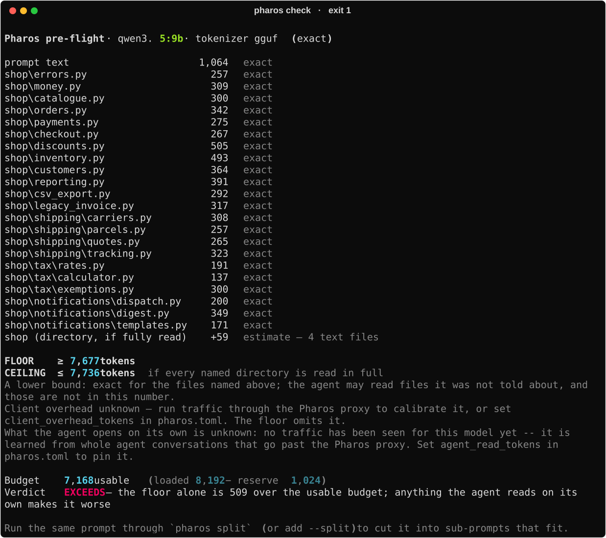
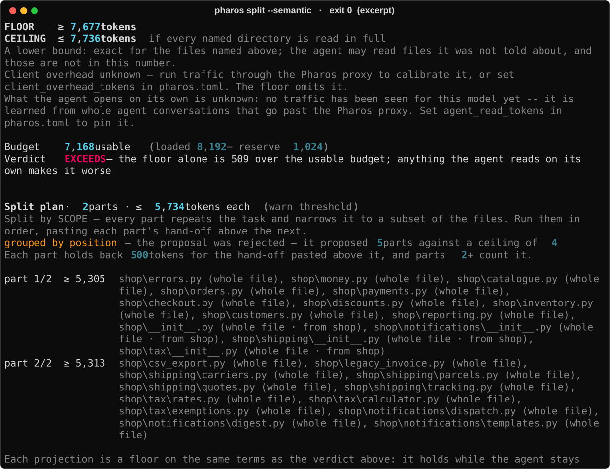
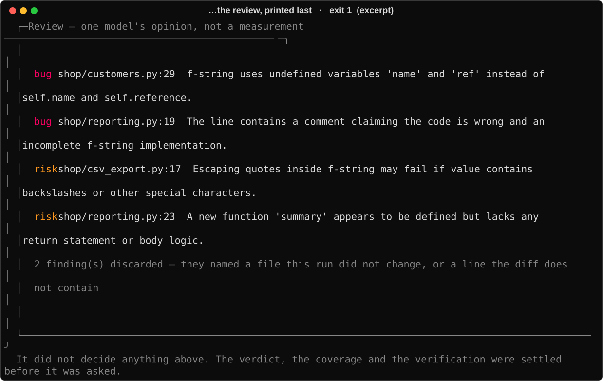

# Pharos

[](https://github.com/ij-jkl/Pharos/actions/workflows/ci.yml)
[](https://www.python.org/downloads/)
[](LICENSE)

**Paste a prompt far too big for your GPU, at your own project, and have the work done anyway.**

A good local coding model fills most of a 12 GB card. What is left will not hold a real prompt,
so the usual choice is a smaller model or a smaller task. Pharos takes neither: it measures what
actually fits, cuts the work into ordered parts that do, runs them one at a time in fresh
windows, carries the thread between them, and checks after every part that your project still
builds — then names the part that broke it.

The model stays big. The context stays small. The whole prompt still gets done.

It works against a local [Ollama](https://ollama.com) instance: the prompt, your code and the
work all stay on your machine.


That is the first of four tools, and the whole run — check, split, thirteen parts, the scorecard
and the review — is in [`docs/pharos-video.mp4`](docs/pharos-video.mp4), 49 seconds, rendered
from the same captures the images below come from.

## Quick start

```bash
git clone https://github.com/ij-jkl/Pharos.git
cd Pharos

./start.sh        # macOS / Linux
.\start.ps1       # Windows
```

Windows ships with script execution disabled, so if `.\start.ps1` is refused for that reason,
run it as `powershell -ExecutionPolicy Bypass -File .\start.ps1` — the flag applies to that one
process and changes nothing on your machine.

The first run installs [uv](https://docs.astral.sh/uv/) if it is missing, fetches Python,
installs dependencies, writes `pharos.toml` and looks for a backend. Every run after that
notices all of it is there and opens the prompt.

Point it at the project you want worked on — one line in `pharos.toml`:

```toml
target_folder = "/path/to/your/project"
```

Leave it out and Pharos plans against the directory it was started in, and says so rather than
letting you find out from the file list.

Then paste the whole thing:

```
pharos> r? Refactor every module in shop/ to f-strings: shop/money.py, shop/orders.py,
        shop/checkout.py, shop/shipping/carriers.py … (5 sections, 6 rules, 4.9 KB)
```

| at the prompt | |
|---|---|
| `<prompt>` | what will this cost, and does it fit? |
| `s <prompt>` | cut one that does not fit into parts that do (`s!` groups them by meaning) |
| `r <prompt>` | **carry it out** — this writes files |
| `r! <prompt>` | the same, stopping at the first part that breaks a file |
| `r? <prompt>` | the same, and review the diff afterwards |
| `d` / `q` | the live dashboard / quit |

No `r` starts without a way back: a clean git tree and its own `pharos-run/…` branch, or a copy
of every original into `.pharos/undo-<timestamp>/` if the folder is not a repository. The keys
run with the defaults; everything else — `--compact`, `--reserve-reads`, `--exclude`, `--json` —
is on the command line below.

Prefer to work from inside your own project? Keep a `pharos.toml` there with
`target_folder = "."` and call the clone from wherever you are:

```bash
uv run --project ~/Pharos pharos                 # proxy + dashboard
uv run --project ~/Pharos pharos check "…"       # what will this cost, and does it fit?
uv run --project ~/Pharos pharos split "…"       # cut it into parts that do
uv run --project ~/Pharos pharos run --review "…"   # carry them out
```

Pharos runs with no GPU and no backend — every number degrades to a labelled N/A. An NVIDIA card
and a local [Ollama](https://ollama.com) make it useful.

## What it looks like

### The gauges, while your agent works

`pharos` is a transparent proxy plus a live dashboard. Point any OpenAI- or Ollama-compatible
client at `http://127.0.0.1:11435` instead of the backend and every request is counted on the way
past. **The proxy never mutates a request or a response** — everything that asks, decides or
writes does so outside the request path, as an ordinary client, exactly like Cursor or Continue.


*A real session, not a mock-up: the model advertises 262,144 tokens and 32,768 are loaded.
Reproduce it with `uv run python docs/capture_dashboard.py`.*

Every count carries how it was obtained — `(exact)` reconciled against the backend's own
`prompt_eval_count`, `(estimate · gguf)` from the model's real tokenizer, `(heuristic chars/4)`
when there is no tokenizer to be had. A number without its provenance is a confident wrong
number.

### The prompt does not fit, and it says so exactly



Every file the prompt names is counted with the model's own tokenizer and labelled `exact`. The
floor is a floor: it holds for the files you named and promises nothing about what the agent
opens on its own — which is what `EXPECTED` predicts, from traffic the proxy has already seen,
once there is enough of it to learn from. This shot has none yet, so it says so rather than
standing a number in the gap.

### So it is cut into parts that do



Every part repeats your task verbatim and narrows the scope to a subset of the files, and each
carries a projected cost measured with the same tokenizer that produced the verdict. Scope is
enforced in the tool layer, not asked for in the prompt — a part given three files physically
cannot open a fourth, which is what turns the projection into a bound.

That shot also catches `--semantic` — the one place Pharos lets a model decide anything — being
turned down: the grouping it proposed spent more parts than it is allowed, so the plan fell back
to position packing and the line says which check failed. A plan that quietly used a model, or
quietly did not, is the one outcome that feature is not allowed to have.

| `pharos check` / `pharos split` | |
|---|---|
| `--file PATH` | read the prompt from a file rather than the argument |
| `--target N` | judge against N tokens instead of the live budget — **this is what lets both commands work with no backend running at all** |
| `--split` | on `check`: when the floor exceeds the budget, print a plan of parts that fit |
| `--semantic` | group the files by meaning instead of by packing order |
| `--exclude PATH` | keep a named file out of the count and out of every part's scope |
| `--resolve REF=PATH` / `--pick` | answer an ambiguous reference, rather than have it guessed |
| `--reserve-reads` | size against what agents have historically opened unprompted |
| `--out DIR` | write each part to `DIR/part-01.txt`, ready to paste one at a time |
| `--quiet` | print only the part bodies, for piping |
| `--json` | the report on stdout, for CI |

### Then it iterates until the whole prompt is done

Each part is its own conversation, seeded only with what crosses the gap: the previous part's
hand-off, and Pharos's own record of what has already landed on disk. When a part's window fills,
`--compact` stubs out the *oldest tool results only* — never the system prompt, never the part
body, never anything the model said — so the part keeps working instead of stopping.

| `pharos run` | |
|---|---|
| `--file PATH` | read the task from a file rather than the argument |
| `--dry-run` | pre-flight and plan only; changes nothing |
| `--no-split` | one undivided conversation — the control case |
| `--semantic` | group the parts by meaning instead of by packing order |
| `--compact` | reclaim the window from files a part has finished with |
| `--reserve-reads` | size the parts against what agents open unprompted |
| `--exclude PATH` | keep a named file out of every part's scope |
| `--stop-on-break` | halt at the first part that breaks a file it wrote |
| `--review` | show the model the diff afterwards and print what it says |
| `--json` | the scorecard on stdout, for CI |
| `--no-git` | skip the clean-tree check and the run branch (you lose the undo) |
| `--no-ledger` | the model's hand-off as the only thread between parts |
| `--no-audit` | skip indexing the tree around each part |
| `--no-verify` | skip the project's own checks afterwards |

### And it tells you whether it worked


**That is a run that went badly, photographed exactly as it came out.** All thirteen parts ran,
the repair part after them died on a tool call the backend could not parse, and the model left
seven of the 22 files it wrote unparseable. Pharos measured all of it, named a part against every
break, and exited 1.

Nothing in that scorecard required asking a model anything: coverage is writes over scope, the
audit re-indexes the tree after every part so a write that was claimed and never landed would be
named, and the verification lines are your own `ruff` and `pytest` — run once before the first
part as a baseline, then after each one. Only a check that **passed before and fails after** can
fail the run.

Three lines are worth reading together. `compaction 4,622 tokens reclaimed across 6 parts` is six
parts that would otherwise have stopped at their ceiling; `headroom 95%` is how close to the edge
the largest request any part actually sent came; and `repair … the plan alone reached 84%` is the
sweep that took coverage to 88% afterwards. That is what a 12 GB card's leftover window looks
like from the inside.

The opinion comes last, under a verdict it cannot change:



`--review` shows the model the diff and prints what it says. Every finding is checked in code
first — it must name a file this run changed and point at a line inside a hunk the model was
actually shown — and the count of discards is printed, because a model asked to review code will
invent a plausible line number and a plausible line number is exactly what a reader trusts.

## Configure

`pharos.toml` is machine-specific and gitignored; `pharos.toml.example` documents every key and
the measurement behind its default. The ones that matter:

| Key | Default | What it does |
|---|---|---|
| `target_folder` | *(cwd)* | The project Pharos reads, plans and writes against. |
| `backend_url` | `http://localhost:11434` | The Ollama instance to forward to. |
| `num_ctx` | *(unset)* | The window `pharos run` asks for. **Unset, Ollama picks 4,096 on a 12 GB card** and the part scaffold alone fills it. |
| `max_files_per_part` | `2` | Most files one part is given. Measured, not guessed — see below. |
| `handoff_reserve` | `500` | Tokens held back in every part for the thread to the next one. |
| `verify_commands` | *(auto)* | Checks run before and after; unset, the ones this repository configures. |
| `proxy_port` | `11435` | Where Pharos listens. |

## What it will not do

- **Mutate a request, ever.** No fields added or removed, no prompt rewriting, no
  `stream_options` injection. The body is forwarded as the bytes it arrived as; what counting
  needs, it takes a copy of. The guarantee is about what Pharos does to *other people's*
  traffic; `--compact` only ever touches a `pharos run` conversation, which is its own.

  Beyond the hop-by-hop headers every proxy is obliged to strip, it has exactly one exception,
  and an unstated exception to a headline guarantee is worth less than no guarantee: when a
  client sends **no** `Accept-Encoding`, Pharos sets `identity` on the upstream hop. Doing nothing is not neutral — httpx would advertise gzip itself and the
  client would receive encoded bytes it never asked to decode. It is the smallest write that
  keeps the promise where it is measured, which is what the client actually receives.
- **Claim the code is right.** It proves the work fit, ran, and still builds. That is a different
  question, with an exact answer, and it is the one Pharos answers.
- **Guess.** An ambiguous file reference is reported, not resolved by coin-flip (`--resolve`,
  `--pick`); a KV rate it can neither measure nor derive is labelled `configured`; a prediction
  with too little behind it prints nothing rather than a small number.

## Benchmarks

Every figure below is from a live RTX 3060 12 GB against Ollama, recorded in
[`DESKTOP_VALIDATION.md`](DESKTOP_VALIDATION.md) — including the runs that went badly.

### The same 4.9 KB prompt, 19 modules, six parts, four runs

A five-section refactor spec that misses the window by 2,307 tokens, run end to end against
`qwen3.5:9b` in an 8,192-token window. Each column is one full run of the identical prompt, as
the continuity fixes landed:

| | run 1 | run 2 | run 3 | run 4 |
|---|---|---|---|---|
| coverage | 83.3% | 77.8% | 72.2% | **88.9%** |
| hand-offs produced (of 5) | 3 | 5 | 5 | 5 |
| thin hand-offs | 2 | 1 | **0** | **0** |
| parts that hit the ceiling | 0 | 0 | 2 | **0** |
| reads refused for room | — | — | 3 | **0** |
| peak of a part's ceiling | 96.7% | 99.8% | 98.3% | 96.7% |
| audit (claims vs. disk) | clean | clean | clean | clean |
| f-string conversions landed | 59 | 42 | — | **72** |

`complete: false` in all four, which is the tool working rather than failing: every run left one
to three files unparseable and Pharos named the parts responsible. Judged from outside Pharos, by
`git diff` and `python -m ast`, the best run converted **72 interpolations across 13 files** and
left one `%` operator in the tree — in `shop/notifications/templates.py`, the file the prompt said
not to touch, untouched for six runs running, along with the test suite.

### The run in the shots above

A different prompt on a different fixture — 25 files, a 22-module `shop/` package, the same 8,192
window — captured by `docs/capture_cli.py` and reproducible with it:

| | |
|---|---|
| parts | 13 planned, 13 run, plus a repair part that failed on an unparseable tool call |
| coverage | 88% — 22 of 25 files; the plan alone reached 84%, the repair sweep rescued 1 |
| the 3 misses | every one a file a part opened and left alone, reported as such |
| continuity | 10 of 12 hand-offs, largest 219 of the 500 reserved, 21 files carried by the record |
| compaction | **4,622 tokens reclaimed across 6 parts**, 0 parts abandoned |
| headroom | 95% of a part's ceiling at the largest request actually sent |
| drift | 0.89–1.01x over **118 paired requests**, worst shortfall 314 tokens |
| audit | clean — 22 changes on disk, every one claimed by the part that made it |
| verdict | `FAILED`, exit 1 — a part could not finish, and three checks broke |
| wall time | 20 minutes |

The failure is the interesting half. A part died on a tool call the backend could not parse, seven
files were left unparseable, and every one of those facts is in the report with a part number
against it — which is the difference between a tool that ran and a tool that tells you what
happened.

### Compaction, A/B on one task and window

Same prompt, same 8,192-token window, same three files; the flag is the only difference.

| | no `--compact` | `--compact` |
|---|---|---|
| coverage | 100% | 100% |
| **parts abandoned at the ceiling** | **2** | **0** |
| tokens reclaimed | 0 | **1,459** |
| what it would have bought (`reclaimable_tokens`) | 1,952 | — |
| wall time | 5m05s | 5m53s |

Two parts that would have stopped ran to the end instead, for 48 seconds.

### What a context token actually costs in VRAM

`kv_mib_per_1k` used to be one hand-tuned constant. Measured by loading each model at several
windows and reading `size_vram` from `/api/ps`:

| model | arch | the old constant said | measured | derived from GGUF metadata |
|---|---|---|---|---|
| qwen2.5-coder:7b | qwen2 | 26 | **56.64** | 54.69 (-3.4%) |
| qwen3-4b | qwen3 | 26 | **142.58** | 140.63 (-1.4%) |
| qwen3.5-9b | qwen35 | 26 | **32.23** | 31.25 (-3.0%) |

A 4.4x spread across three models. With 4 GB free, the constant claimed **153,846** further
context tokens where **28,050** was the truth — advice pointing straight at the OOM this project
exists to warn about. So the rate is measured on your machine where three windows above 8K allow
it, derived from the model's own metadata where they do not, and labelled either way.

### Two files per part, because that is what a part finishes

On one 13-file task against `qwen2.5-coder:14b`, a part completes about **1.5–2.0 files** and then
believes itself finished, whatever it was given. Window pressure was never the cause (peak usage
sat at 42–51% of the ceiling) and persuasion did not help — stating the target up front, naming
the outstanding files and asking again all failed. At four files per part that task covered
**46%, 62%, 46%**; at two, **92%**.

That was measured at v0.4, before the coder models were found not to emit native tool calls and
`pharos run` moved to the qwen3.5 family. The limit it found outlived the model that showed it:
`max_files_per_part = 2` is the default every later run on this page was planned with.

### The chat template costs a fixed number of tokens, not a ratio

Seventeen paired requests over conversations from 1,235 to 3,604 tokens put the gap between
Pharos's projection and the backend's `prompt_eval_count` at a flat **263–314 tokens**, while the
ratio it implied fell from 1.22x to 1.09x. Applied as a ratio on a 60K conversation, that would
throw away more than 13,000 tokens of every part. It is remembered per model between runs, so
every part's ceiling starts corrected.

## Development

```bash
uv run ruff check .
uv run mypy pharos
uv run pytest
```

**866 tests**, `ruff` and `mypy --strict` clean, on Python 3.12 and 3.13 across Linux and Windows.
`tests/test_end_to_end.py` runs the whole loop against a mocked backend and feeds each generated
part back through the checker — the splitter's projection and the checker's floor come from
different code, and a plan whose parts do not re-check as fitting is fiction. `CHANGELOG.md` is
the release history.

## Author

Built by **Isaac Jordan** — [LinkedIn](https://www.linkedin.com/in/isaac-jordan-464563215/)

Licensed under the [MIT License](LICENSE).
